**************
MS SQL Server
**************

I. Overview
========

This template is used to monitor the SQL Server 2005 or 2008. It produces metrics in these categories:

-	Monitors the SQL Server database stats
-	Monitors the SQL Server processes
-	Monitors the SQL Server error log

The solution consists of an include file that contains all required samplers (FKM, Processes, Perfmon and SQL Toolkit), sampler includes (FKM, Processes) and types.

II. Detailed solution
=================

Monitoring the SQL Server database
----------------------------------

We collect perfmon counters and run sql queries to get the following metric:

*	Buffer manager 
*	Database size
*	Database version
*	Database error 
*	Database locks
*	Database status
*	Disabled jobs
*	Job status
*	Last backups
*	Latches
*	Locks
*	Long running queries
*	Memory manager 
*	Primary cluster 
*	Server status 

1. Buffer manager information

We provide the following metric with the buffer manager information:

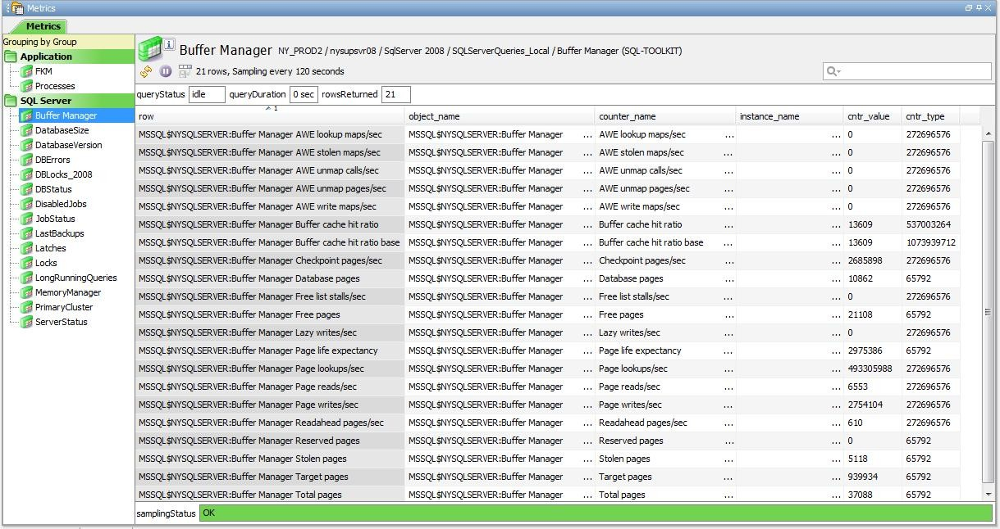

2. Database size

Database size metric window provides the following information:

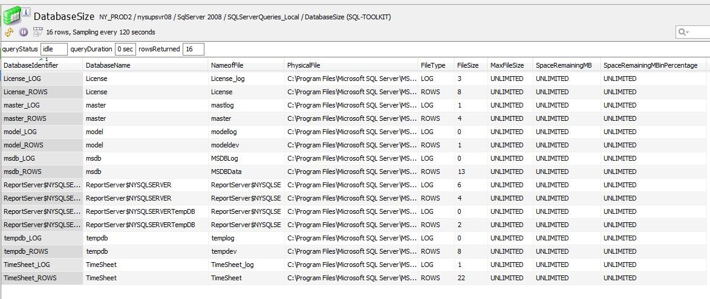

3. Database version

Database version metric window provides you with the information on the current running version of the Microsoft SQL Server.

4. Database error information

The error information is collected via perfmon counters. Here we provide metric on DB Offline Errors, Info Errors, Kill Connection Errors and User Errors (all displayed in Errors/sec),

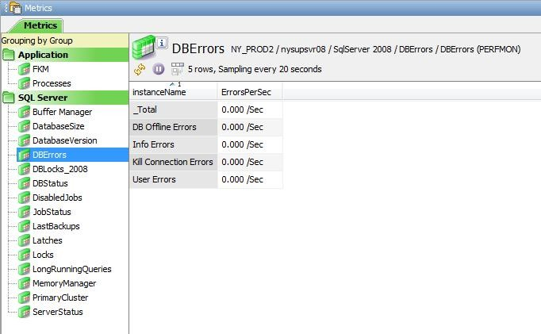

5. Database locks

Database locks metric is provided by reading the perfmon counters. The metric view is the following:

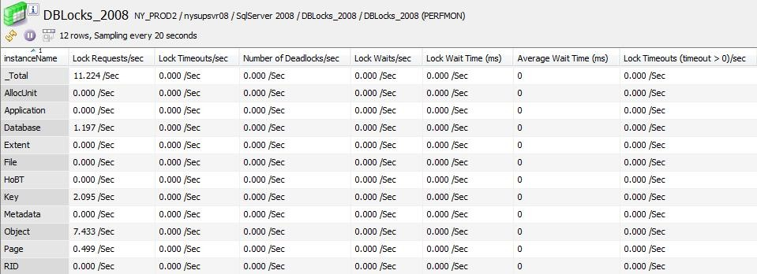

6. Database status
	
Database status information includes this metric view:

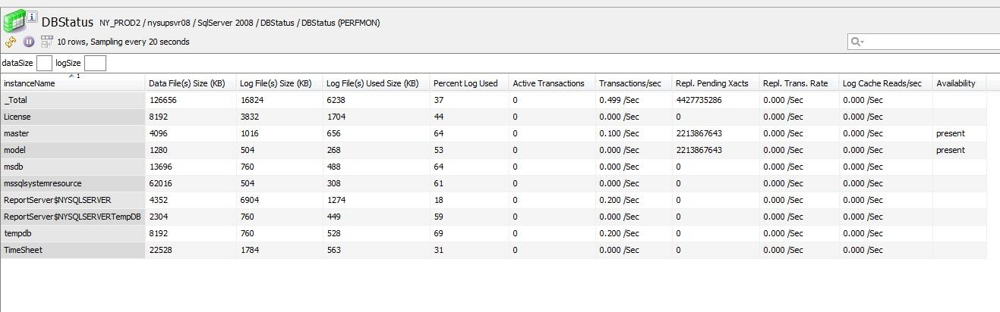

7. Disabled jobs

Disabled jobs are a list acquired by running a sql query. The metric gives details on the date created, date modified and the description of the job, as presented in the following metric view:

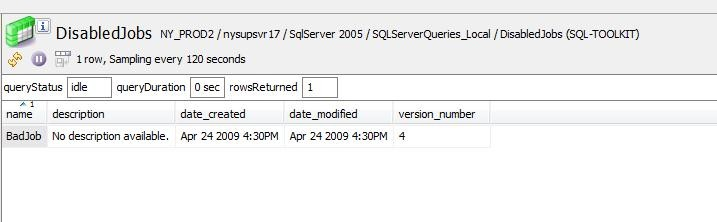

8. Job status

Job status information is collected by running a sql query. The following is a metric view with all the details provided:

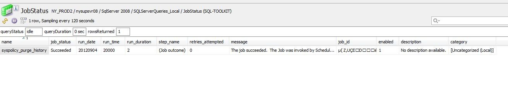

9. Last backups

The following is the metric view that provides the results of the queries ran to collect the info on the last ran backups:

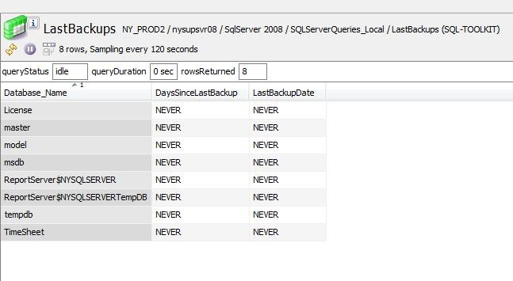

10. Latches

The following is the metric view that provides the information on the latched (acquired by running sql query):

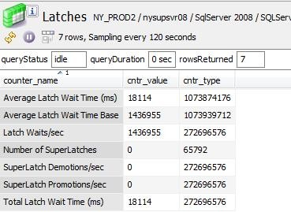

11. Locks

Locks metric is provided by running a sql query. The following is the metric window with all the locks details:

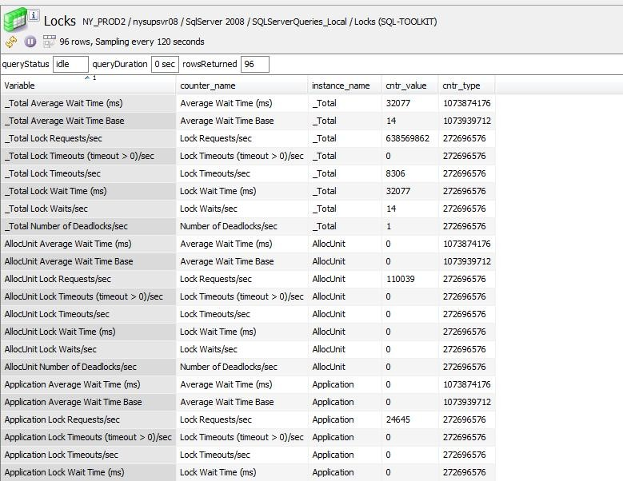

12. Long running queries

Long running queries metric is the following:

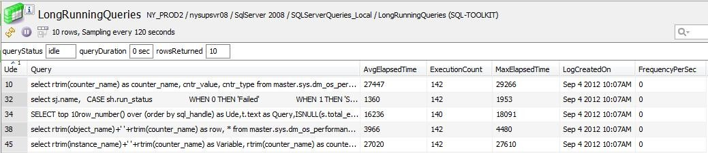

13. Memory manager

Memory manager stats are collected via perfmon counters. The following is the metric view:

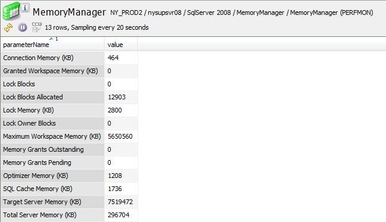

14. Primary cluster information

Primary cluster information gives you the info on the cluster name and the server name.
It is gathered by running a sql query.

15. Server status

Server status statistics are collected by reading the perfmon counters. These counters provide the following information:

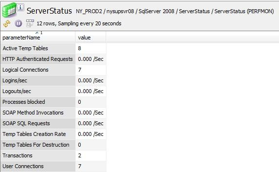

Monitoring the SQL Server processes
----------------------------------

We are monitoring that the following processes are running:

*	SQL Server
*	SQL Server Agent
*	SQL Server Browser
*	SQL Server FullText Search
*	SQL Server Integration Services
*	SQL Server VSS Writer

Monitoring the SQL Server error log
----------------------------------

Error log is monitored by looking for keyword "error". We monitor the log in its common location:

	C:\Program Files\Microsoft SQL Server\$(sql_instance_log)\MSSQL\LOG\ERRORLOG
	
Where $(sql_instance_log) depends on whether you are using a default database installation or a named instance one.

(see more details in Using the solution template)

III. Using the solution template
===========================

This part covers how to implement this solution template in an existing Geneos environment

1. Apply the include file
----------------------

The solution template consists of the include file that needs to be included in the main gateway setup file.

2. Choose and apply the type
-------------------------

The include file has the following types that need to be added to the Managed Entity or the Managed Entity group:

* SQL_SERVER_2008_Local
* SQL_SERVER_2005_Local
* SQL_SERVER_Remote

The Local Type is to be used if the netprobe is running on the SQL Server host.

If the netprobe is running on a host remote to the SQL Server, please use the Remote Type.

3. Enable log and process monitoring
---------------------------------

On the Managed Entity that will have one of these types, the following is required:

* Enable FKM and Processes sampler in the Basic Tab of the Managed Entity
* Enable SQL Server Processes and SQL Server Error Log sampler includes in the Advanced Tab

4. Add the variables to the Managed Entity advanced tab
----------------------------------------------------
On the advanced tab of the Managed entity, add the following variables:

- In the case of using the Local Type from step 2 and named instance installation, add the following variables (string type):

+------------------------+----------------------------+
| sql_instance           | MSSQL$NYSQLSERVER          |
+------------------------+----------------------------+
| sql_instance_log       | MSSQL10.50.NYSQLSERVER     |
+------------------------+----------------------------+
| servername             | nysupsvr08\nysqlserver     |
+------------------------+----------------------------+
| dbname                 | Geneos                     |
+------------------------+----------------------------+

sql_instance : MSSQL$NYSQLSERVER
sql_instance_log : MSSQL10.50.NYSQLSERVER
servername : nysupsvr08\nysqlserver
dbname 	: Geneos

- In the case of using the Local Type from step 2 and default database installation, add the following variables (string type):

sql_instance : SQLServer
sql_instance_log : MSSQL.1
servername : nysupsvr08
dbname	: master

- In the case of using the Remote Type from step 2, add the following variables (string type):

sql_instance : (see step a or b for details)
sql_instance_log : (see step a or b for details)
servername : (see step a or b for details)
dbname : (see step a or b for details)
username : actual_username
pwd : actual_password (where the pwd variable type can be stdEncodedPassword type instead of string)

